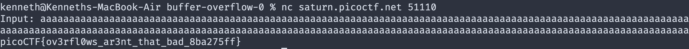

### gets BUGS
Never use gets(). Because it is impossible to tell without knowing the data in advance how many characters gets() will read, and because gets() will continue to store characters past the end of the buffer, it is extremely dangerous to use. It has been used to break computer security. Use fgets() instead.

### strcpy BUGS
If the destination string of a strcpy() is not large enough, then
anything might happen.  Overflowing fixed-length string buffers
is a favorite cracker technique for taking complete control of
the machine.  Any time a program reads or copies data into a
buffer, the program first needs to check that there's enough
space.  This may be unnecessary if you can show that overflow is
impossible, but be careful: programs can get changed over time,
in ways that may make the impossible possible.

