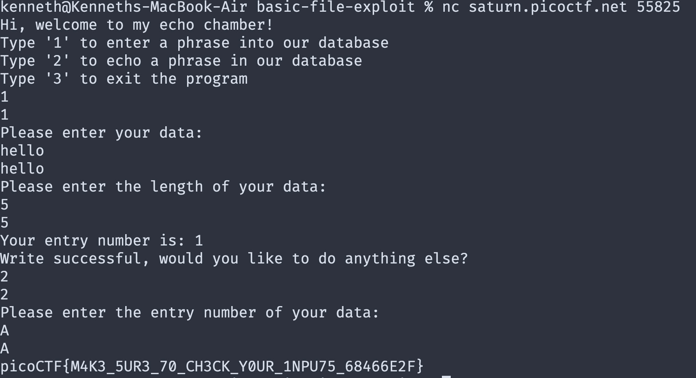
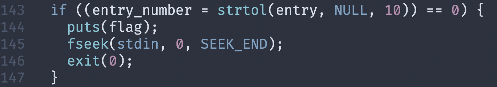

The strtol library function in C converts a string to a long integer. The function works by ignoring any whitespace at the beginning of the string, converting the next characters into a long integer, and stopping when it comes across the first non-integer character.

if our entry_number is AAAA or Any other string, it will stop right away and the value will be 0
if its say 1111AAAA, output will be 1111
if its 0, then 0
